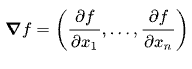

* # <벡터> 

---
* # <행렬>
  * 행렬곱
    * 행과 열의 조건을 맞춰야 연산가능함.
  * 역행렬
    * 곱의 연산을 했을 때 항등행렬이 나온다.
  * 유사 역행렬
    * 무어펜로스(Moore-Penrose) 역행렬
      * 
      * `np.linalg.pinv`
      * 행과 열의 크기에 따라 순서가 달라지니 유의 할 것.
    * 연립방정식, 선형회귀 분석에 응용됨.
  * `생각`
    * 왜 행렬을 배우는가? 차원이동, 연산
  * 문제
    * 사이킷런의 선형회귀 모델과 무어펜로즈의 선형회귀를 직접 구현해보시오.

#### 딥러닝을 제대로 이해하기 위해선 '선형대수학'을 수준 높게 학습해야 한다

---
# <경사하강법> 
* 미분
  * 접선의 기울기
  * sysmpy.diff -> 미분계산 가능
  * **<어느 차원에서든>** 그 점에서 증가하는가, 감소하는가를 알 수 있다.
  * 어느 차원으로 확장한다는 것은 변수를 스칼라가 아닌 벡터를 사용한다는 것.
* 경사하강법
  * 감소하는 방향으로 쭈욱 가다 보면 언젠가 평지를(극소값)을 만날 것이야 => 경사하강법
  * 컴퓨터에서 미분값이 0 인 곳을 찾기란 쉽지 않으므로 아주 작은 값(오메가) 보다 더 미분 값이 작으면 종료하면 되시것다.
  * 학습률 -> 얼마나 큰 보폭으로 갈것인가? (하이퍼 파라메터)
  * 모든 데이터 사용
    * 성능이 확률적 경사 하강법에 비해 좋지 않고, 하드웨어에 부담이 간다.
* 변수가 벡터인경우엔
  * 편미분을 사용한다.
* 그레디언트 벡터
  * 벡터의 변수 별로 편미분을 계산한 함수
  * 
  * 그레디언트 벡터에 - 를 붙여서 이동하게 되면 **가장 빨리** 극소값을 향해 가게 된다.
  * 그레디언트 벡터의 `norm` 값을 구해서 일정 값보다 작게 되면 학습을 종료하는 방식으로 극소값을 찾으면 된다. (계속 내려가다가 더 이상 변화가 없는 것 같아. -> 일단 멈춰!)
# 선형회귀 모델에서 경사하강법 적용해보기
* 위에서 무어 펜로즈 행렬을 통해서 선형 모델을 어떻게 찾아야 할 지 알았다.
* 우리가 해야 할것은 무어펜로즈 행렬을 곱해서 나온 우변 식을 경사하강법을 하지 않고 !! 오직 경사 하강법을 적용시켜 극소값이 되는 지점을 찾는 것이다.
* #####  this is funny ! 
  * 직접 계산해보자.
* 학습률과 학습횟수를 적절하게 선택했을 때만 수렴을 보장할 수 있다.
* 비선형회귀의 경우, 볼록하지 않기 때문에 수렴을 보장할 수 없다.

# 확률적 경사하강법
*   데이터를 일부 사용해서 경사하강법을 적용하는 것.
  * 데이터 하나만 사용

# 미니배치 확률 경사하강법 (일반적)
  * 데이터 여러개 사용 
  * SGD 가 경사하강법보다 낫다는 것이 실증적으로 검증되었다.
  * 데이터를 일부로 사용하기 때문에 목적식이 매번 달라짐.
  * 학습률, 미니배치사이즈 고려해야 함.
* 

